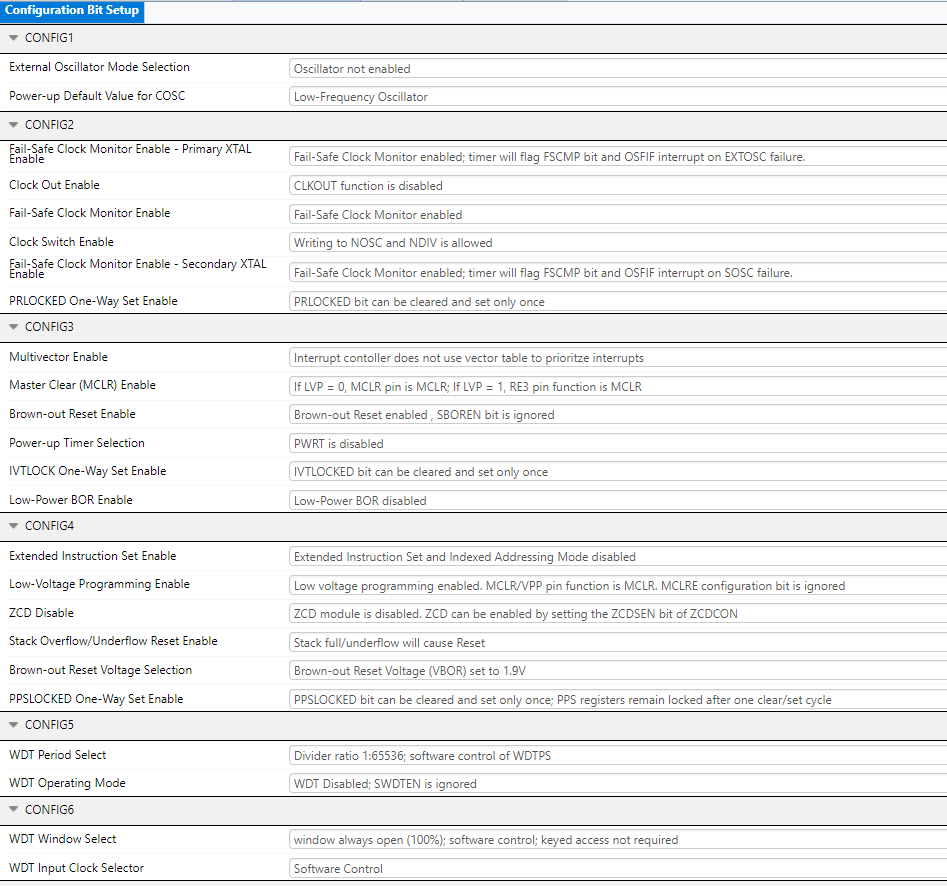
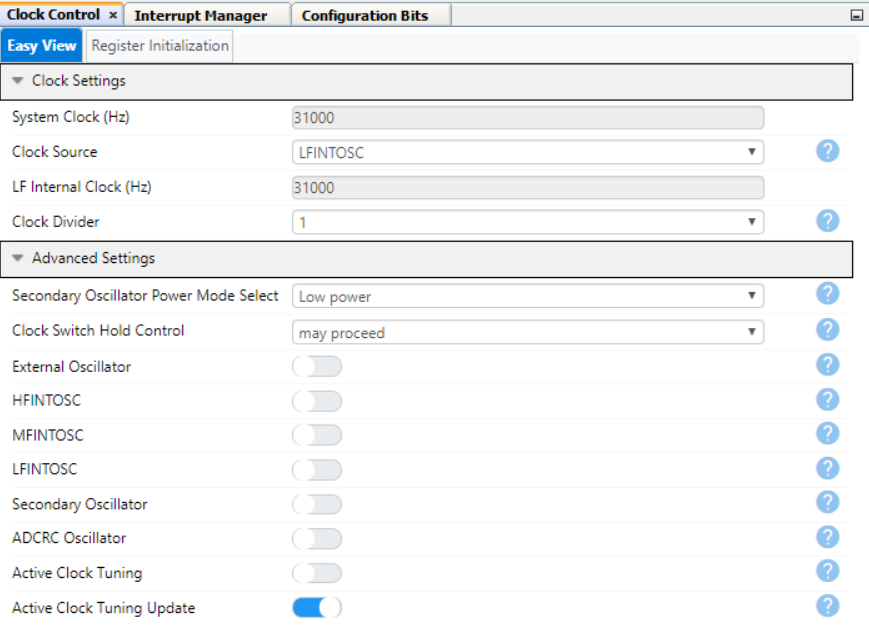
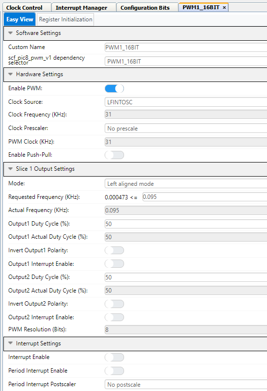
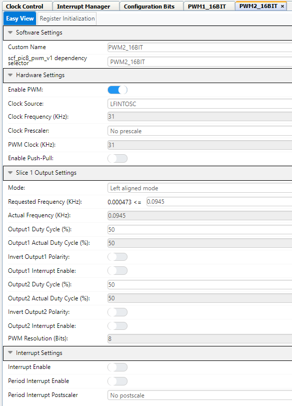
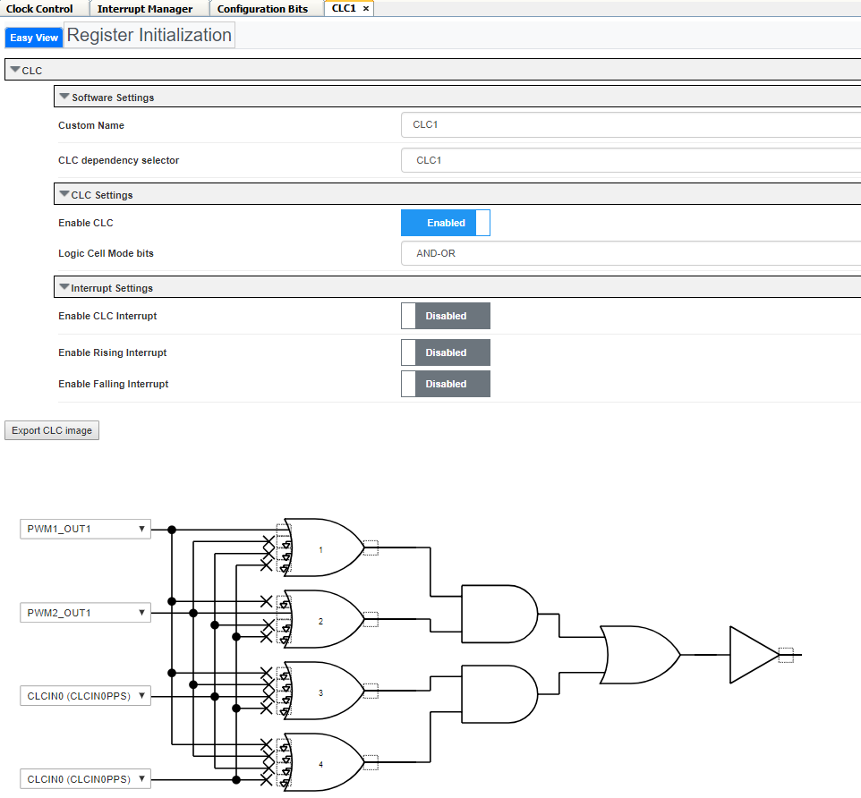
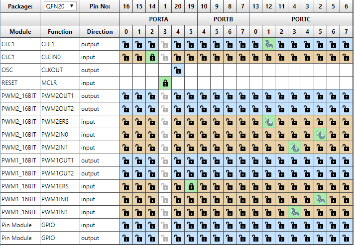

# Breathing LED PWM Demo for PIC18F16Q41

In this application, we will make the LED appear to breathe by using 2 PWM peripherals running at different frequencies

## Related Documentation

* [PIC18F16Q41 Datasheet](https://ww1.microchip.com/downloads/en/DeviceDoc/PIC18F06-16Q41-DataSheet-40002214C.pdf)

* [PIC18F16Q41 Device Page](https://www.microchip.com/wwwproducts/en/PIC18F16Q41)

* [PIC18F16Q41 Curiosity Nano Users Guide](https://ww1.microchip.com/downloads/en/DeviceDoc/PIC18F16Q41-Curiosity-Nano-Hardware-User-Guide-DS50003048A.pdf)

## Software Used

* [MPLAB® X IDE v5.45](https://www.microchip.com/en-us/development-tools-tools-and-software/mplab-x-ide)
* [MPLAB Code Configurator (MCC) v4.1.0](https://www.microchip.com/mplab/mplab-code-configurator)
  + Melody Library v.1.37.22(or later)
* [MPLAB XC8 Compiler v2.31](https://www.microchip.com/en-us/development-tools-tools-and-software/mplab-xc-compilers)
* [PIC18F-Q_DFP v1.8.154](https://packs.download.microchip.com)

## Hardware Used

* [PIC18F16Q41 Curiosity Nano (EV26Q64A)](https://www.microchip.com/DevelopmentTools/ProductDetails/PartNO/EV26Q64A)

## Setup

**Step #1: Creating the Project**
+ Microchip Embedded; Standalone Project
+ Enter the Device
  + For this Project: PIC18F16Q41
+ Enter a name for this project, such as *BreathingLED*
  + Name: “BreathingLED”
  + **Note: The project name cannot have any empty spaces**

  **Step #2: MPLAB Code Configurator (MCC)**

  * Set Configuration Bits
    + Disable "External Oscillator Mode Selection"
    + Set "Power-up Default Value for COSC" to "Low-Frequency Oscillator"
    + "WDT Operating Mode" is set to "WDT Disabled; SWDTEN is ignored"

    

  +	Modify the Clock Control
    +	Set “Clock Source” to Low Frequency Internal Oscillator (LFINTOSC)
    + Set “Clock Divider” to 1

    

  **Step #3: Adding PWM and CLC Peripheral**
  + In Device Resources:
      + Drivers &rarr; PWM &rarr; PWM1_16BIT
      + Drivers &rarr; PWM &rarr; PWM2_16BIT
      + Drivers &rarr; CLC &rarr; CLC1
  + Once the peripherals are added, modify the peripherals.
    + The 2 PWM peripherals are set at slightly different frequencies.
  + PWM1_16BIT
    + **Hardware Settings:**
      + Enable PWM: ENABLED
      + Clock Source: LFINTOSC
      + Clock Prescaler: No Prescale
    + **Slice 1 Output Settings:**
      + Mode: Left aligned mode
      + Requested Frequency: 0.095 kHz (95 Hz)

      

  + PWM1_16BIT
    + **Hardware Settings:**
      + Enable PWM: ENABLED
      + Clock Source: LFINTOSC
      + Clock Prescaler: No Prescale
    + **Slice 1 Output Settings:**
      + Mode: Left aligned mode
      + Requested Frequency: 0.0945 kHz (94.5 Hz)

      

  + CLC1
    + Mode: "AND-OR"
    + The two PWM signals need to be connected to the top two logic gates in the CLC1 configuration.
      + Connect PWM1_16BIT to OR gate 1
      + Connect PWM2_16BIT to OR gate 2

    

  **Step #4: Configure the Pins**
  + Configure the CLC1 output to be connected to pin RC1

    

  **Step #4: Generate the project**
  + Click the generate button in MCC to create the appropriate header and source files for this configuration

  + If everything is setup correctly, the LED will begin to pulse; similar to a breathing effect.

  

## Summary

This application shows how to set up the PWM and CLC peripherals to make an LED breathe.
